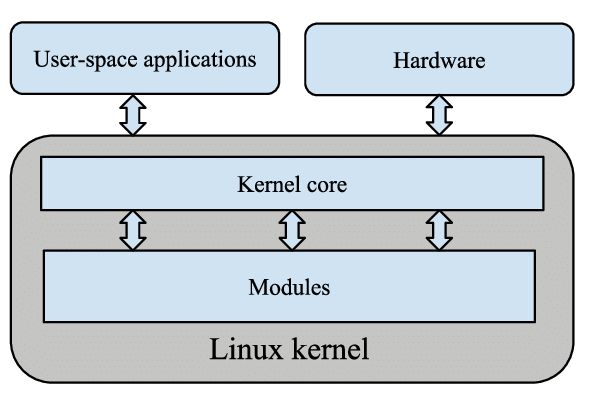

# CSPB-3753  Programming Assignment 1 :  Loadable Kernel Module
<figure width=100%>
  
</figure>
<hr>
    
Adding functionality to the kernel can be accomplished using differenct methods.
 To create a new system call, you must write the code, find a new slot in the system call junp table, add the new function to the system call jump table, add new files to the build,  and then recompiler the operating system.   There are thousands of files in the kernel that need to be build.  Luckily it is all done using makefiles so only the changed files need to be recompiled after fixing bugs or developing new functionality.   
 
The more difficult part is getting that new kernel to be run.  You must place the kernel into the boot loader and reboot your system.  If the kernel fails to load because of the new code changes, you must reboot and select a previous kernel.  If you code does not work as required, you will need to fix the bug and go through all those steps again to boot the new kernel.

### Installing a custom kernel on a Linux system typically involves several steps
Here's a general outline of the process:
* Obtain the kernel source code: Download the source code of the custom kernel you wish to install. You can usually find it on the kernel developer's website or through a version control system like Git.
* Prepare the system: Ensure that your system meets the necessary requirements for building and installing a custom kernel. This may involve installing development tools, headers, and other dependencies.
* Configure the kernel: Customize the kernel configuration to suit your specific needs. This can be done through the kernel's configuration menu (e.g., make menuconfig, make xconfig) or by modifying a configuration file directly.
* Build the kernel: Use the appropriate commands (e.g., make) to compile the kernel source code into a usable binary. This process may take some time depending on your system's specifications.
* Install the kernel modules: If your custom kernel includes any loadable kernel modules, you'll need to install them as well. This typically involves running commands like make modules_install or manually copying the module files to the appropriate locations.
* Install the kernel image: Copy the compiled kernel image (usually named vmlinuz) to the appropriate location on your system, typically in the /boot directory.
* Update the bootloader configuration: Modify the bootloader configuration file (e.g., GRUB or LILO) to include an entry for the new custom kernel. This step ensures that the system can boot into the custom kernel.
* Update the bootloader: If necessary, update the bootloader to reflect the changes made in the configuration file. This step varies depending on the bootloader in use and may involve running a command like update-grub or grub2-mkconfig.
* Reboot the system: After completing the previous steps, reboot your system to load the newly installed custom kernel. Ensure that you select the correct kernel entry during the boot process.

It's important to note that installing a custom kernel carries some risks, and it's recommended to have a backup or recovery plan in case any issues arise. Additionally, the exact commands and steps may vary depending on your specific Linux distribution and the version of the custom kernel you're installing.  You must rebuild the kernel and walk through the steps to get it to boot, every time you make a change.
 
<figure width=100%>
  
</figure>

Loadable Kernel Modules (LKMs) are dynamically loadable and unloadable software modules in the Linux kernel. They allow for adding or removing functionality from the kernel without the need to reboot the system. LKMs can be thought of as plugins or extensions for the kernel.

LKMs can provide additional device drivers, filesystems, networking protocols, and other kernel-level functionality. They can be loaded and unloaded at runtime, providing flexibility and modularity to the Linux kernel. LKMs are widely used to extend and customize the functionality of the Linux operating system.

 
The LKM interface is a set of functions and mechanisms provided by the Linux kernel to allow the loading, unloading, and management of kernel modules. This interface provides a standardized way for LKMs to interact with the kernel and utilize its services.  
The LKM interface typically includes functions for module initialization, cleanup, and handling of module parameters. It also provides functions to register and unregister module-specific functionalities such as device drivers, filesystems, and network protocols. 
By conforming to the LKM interface, developers can ensure compatibility and portability of their modules across different kernel versions and distributions. The LKM interface abstracts the complexities of interacting with the kernel, making it easier to develop and maintain loadable kernel modules for the Linux operating system.
 
 
<hr> 
 
## Device Drivers
<figure width=100%>
  
</figure>

Device drivers are used to enable communication between the operating system and various hardware devices. Almost all hardware devices in a computer system require a device driver for proper functioning. Some common types of devices that use device drivers include:

* Printers and Scanners: Printers and scanners require device drivers to communicate with the operating system and enable printing, scanning, and other related functions.
* Graphics and Display Devices: Graphics cards, video adapters, and display monitors utilize device drivers to provide the necessary interface for the operating system to control and display graphics on the screen.
*Network Interface Cards (NICs): Network interface cards, including Ethernet adapters and Wi-Fi cards, require device drivers to enable network connectivity and facilitate data transmission between the computer and the network.
*Sound Cards: Sound cards utilize device drivers to enable audio playback, recording, and control audio settings and features.
*Storage Devices: Hard drives, solid-state drives (SSDs), optical drives (CD/DVD), and other storage devices require device drivers to facilitate data storage and retrieval operations.
* USB Devices: USB devices such as keyboards, mice, game controllers, external hard drives, and other peripherals require device drivers to establish communication and enable their specific functionalities.
* Input/Output Devices: Various input/output devices such as keyboards, mice, touchpads, touchscreens, and other input devices use device drivers to transmit input signals to the operating system and receive output instructions.
* RAID Controllers: RAID controllers, used for managing redundant array of independent disks (RAID) configurations, require device drivers to manage data storage and fault tolerance.
* Audio Devices: You can connect speakers or headphones to the audio output to enable audio playback.
* Sensors: A wide range of sensors such as temperature sensors, humidity sensors, motion sensors, light sensors, and more produce a stream of characters that can be interpreted to get the sensor readings. These sensors can enable environmental monitoring, home automation, and various IoT (Internet of Things) applications.
* Motor Controllers: The hardware port allows acccess to the physical devices such as motor controllers that would control motors for robotics projects, motorized vehicles, and other physical computing applications.    

These are just a few examples of the many hardware devices that rely on device drivers to interact with the operating system. Device drivers provide the necessary software abstraction to ensure seamless communication and integration between hardware and software components.

<hr>

## Creating Your Own Simple Character Device Driver
Your task for the programming assignment is to implement a LKM device driver for a simple character device that supports reading, writing, and seeking. 
This assignment assumes you have completed the first two labs that explore the File IO system calls. 
**You are advised to complete those labs before beginning this assignment.**
 
Based on your exploration of the File IO system calls, you will now create a kernel module that can support the basic management of a device and transferring data to and from the device.   
 This buffer will be a virtual file that can be read and written.
 The device will allocate a kernel buffer when the module is loaded.
 The device will maintain the kernel data structures and validate the transfer of data to garuantee that memory is handled securely (no overwrites).
 The LKM interface for devices is similar to the interface to a file.  
 In fact, the disk is just a device (block device) and uses a similar interface to support file IO.
  
A simple device driver is a software component that allows communication between an operating system and a specific hardware device. It provides an interface for the operating system to interact with the device, enabling it to send commands, receive data, and manage device operations.

A simple device driver typically consists of two main components:
* Initialization and setup: The driver initializes the device, performs any necessary configurations, and establishes communication with the operating system. This may involve tasks such as allocating resources, setting up interrupts, and registering the device with the kernel.
* Device operations: The driver implements functions or methods that handle various device operations, such as reading from and writing to the device, handling interrupts, managing power states, and performing other device-specific tasks.
Simple device drivers are often written for specific hardware devices with well-defined interfaces and straightforward functionality. They serve as examples or starting points for more complex device drivers and provide a basic understanding of how device drivers work.

It's worth noting that the complexity of device drivers can vary significantly depending on the hardware and the desired level of functionality. Simple device drivers may only provide basic functionality, while more advanced drivers may support advanced features, error handling, and additional device-specific operations.
 
<hr>

### Building Loadable Kernel Modules (LKMs)

Recall that the kernel uses <i>jump tables</i> in order to call the correct device drivers and functions of those drivers. Each LKM must define a standard jump table to support the kernels dynamic use of the module. The easiest way to understand the functionality that must be implemented is to create a simple module. 
 
We will create a new module `helloworld` that will log the functions being called. 
 You should find the `hellomodule.c` file in the repository. 
 Create a new directory called `helloworld` in the `/home/kernel/` directory. 
 Open the `hellomodule.c` file in your editor.

This simple source file has all the code needed to install and uninstall an LKM in the kernel. 
 There are two macros listed at the bottom of the source file that setup the jump table for this LKM.
 Whenever the module is installed, the kernel will call the routine specified in the `module_init` macro, 
 and the routine specified in the `module_exit` will be called when the module is uninstalled. 
 For writing your LKM, you should use the `helloworld` module as a template.

<hr>

### Compiling Source Code for a New Device Driver

Let's now compile the module. There are a couple of ways to add your module to the list of modules to be built for a kernel. One is to modify the makefile used by the kernel build. The other is to write your own local makefile and attach it to the build when we want to make the modules. The latter is a bit safer, so what we'll do is create a new file called `Makefile` in the `/home/kernel/helloworld` directory, then type the following lines in the file:

```
obj-m:= hellomodule.o
all:
	make -C /lib/modules/$(shell uname -r)/build M=/home/kernel/helloworld modules

clean:
	make -C /lib/modules/$(shell uname -r)/build M=/home/kernel/helloworld modules
```

Here, `obj-m` means that we are creating a module `hellomodule.o` from the source code file `hellomodule.c`, thus `hellomodule.c` should be in the same directory as your `Makefile`. In the `/home/kernel/helloworld` directory, run the following command:
```
make
```
You should now see the kernel object code `hellomodule.ko` in that directory.  In the following section, we will learn how to install your module into the kernel, then uninstall the module from the kernel. For writing your LKM, you should consider making a new directory in `/home/kernel/` for your Makefile and source code.

<hr>

### Installing/Uninstalling LKMs

To insert the module, type the following command:
```
sudo insmod hellomodule.ko
```
The kernel has tried to insert your module. If it is successful, the `module_init()` function will be called and you will see the log message that has been inserted into `/var/logs/system.log`. If you type `lsmod` you will see your module is now inserted in the kernel.

Let's now uninstall the module from the kernel by using the following command:
```
sudo rmmod hellomodule
```
To verify that the module was uninstalled, check the system log and you should see your module exit message. You can also use the `lsmod` command to verify the module is no longer in the system.

<hr>

## Creating a Virtual File for the Device

We know that device drivers can be dynamically installed into the kernel, but how does the kernel know which device driver to use with which device? 

Each device will have a corresponding device file that is located in the `/dev` directory. If you list the files in that directory you will see all the devices currently known by the kernel. These are not regular files, they are <i>virtual files</i> that only supply data from or give data to the device. There is not any physical storage on the disk for these devices like the files that we are used to. The device driver code is responsible for creating a mechanism to store all the information.

To add a new device you need to create a new entry in the `/dev` directory. Each virtual file has information associated with it to tell the kernel which device driver to use when accessing the device. Recall that in Linux, each device driver is given a device \emph{major number} to uniquely identify it.

You can create a new virtual device file to be associated with your device driver. First, we'll find an unused major number for your kernel, then we'll use the `mknod` command to create a new device entry and associate the new major number for your device driver. 
```
sudo mknod  <location> <type of driver> <major number> <minor number>
```
The major number should be unique and you can look at current devices already installed, but usually user modules start at 240.  The <i>minor number</i> can be 0. The type of your driver should be `c` for character. Note that more sophisticated drivers must deal with blocks of arbitrary data, in which case the type is `b` (see `man mknod` for more details).  Putting it all together, run the following command:
```
sudo mknod /dev/simple_character_device c 240 0
```
Note that `simple_character_device` is a file, so we can change its permissions using `chmod`.  To be sure that we can read, write, and execute this file, run the following command:
```
sudo chmod 777 /dev/simple_character_device
```
Using `hellomodule.c` as template, in a new C file `my_driver.c`, your task is to create a new character device driver that suports the following file operations: 
```
open, read, write, llseek, release
```
which we will discuss in more detail momentarily.
You will need a character buffer is needed to store the data for this device. It will exist as long as the module is installed. Once it is uninstalled, all data will be lost. The buffer must be an array of 1024 characters.  In the next section, we discuss how we <i>register</i> your device driver.

## Registering/Unregistering the Device Driver
Recall that each device's virtual file is created with a major number associated with it, which allows the kernel to find the code that has been assigned to the major number when an applications tries to perform file operations upon it.
This means that when a module is loaded, it needs to tell the kernel which device it will be supporting by associating a major number with the module. Since your device is a character device, this can be accomplished using the `register_chrdev()` function, whose prototype is stated below:
```
int register_chrdev (unsigned int  major, 
			const char *  name, 
			const struct file_operations * fops);
```
Its first argument is self-explanatory, as is the second (recall that we called your virtual file `simple_character_device`, so we could pass that as your string).  The third parameter deserves a proper discussion which we will get to momentarily. We also need to unregister your device driver if we decide to unload the kernel module.  This is accomplished with the `unregister_chrdev(unsigned int major, const char* name)` function.


Below is the definition of the somewhat involved `file_operations` struct:
```
struct file_operations {
       struct module* owner;
       loff_t (*llseek) (struct file* , loff_t, int);
       ssize_t (*read) (struct file* , char* , size_t, loff_t* );
       ssize_t (*write) (struct file* , const char* , size_t, loff_t* );
       int (*readdir) (struct file* , void* , filldir_t);
       unsigned int (* poll) (struct file* , struct poll_table_struct* );
       int (*ioctl) (struct inode* , struct file* , unsigned int, unsigned long);
       int (*mmap) (struct file* , struct vm_area_struct* );
       int (*open) (struct inode* , struct file* );
       int (*flush) (struct file* );
       int (*release) (struct inode* , struct file* );
       int (*fsync) (struct file* , struct dentry * , int datasync);
       int (*fasync) (int, struct file* , int);
       int (*lock) (struct file* , int, struct file_lock* );
       ssize_t (*readv) (struct file* , const struct iovec* , unsigned long, loff_t* );
       ssize_t (*writev) (struct file* , const struct iovec* , unsigned long, loff_t* );
    };  
```
Except for its first member, all of its members are pointers to functions.  Each of these members supports some file operation functionality, and it is your responsibility to provide implementations of these operations (you can think of this struct like a Java interface in that it specifies the functionality that we the programmer must implement).
If we do not provide an implementation of any one of these functions, then the corresponding member is set to NULL by default, then the system will take care of the implementation of the function to give it some default functionality.  For this assignment, we won't provide implementations for the majority of these members.

You might have also noticed the `_t` suffix naming convention.  This stands for "type" and it is your makeshift C way of announcing what kind of data we should be expecting. There are no objects in C, so these are primitive data types, but it tells the programmer how to interpret the data.  For example, an implementation of `read` should return a value of "signed size type": if the output is positive, then it's a valid size; otherwise, it signals an error.

For the purposes of this assignment, your file operations struct, that we will pass as an argument to `register_chrdev()`, can be global and static. For example, if we were just concerned about implementing `read`, then this declaration would look something like this:
```
// recall that . is the member access operator in C
static struct file_operations simple_driver_fops =
{
    .owner   = THIS_MODULE,
    .read    = my_read,
};
```
where `my_read` is a function that implements `read`.  The prototype of your read function should of course be:
```
ssize_t my_read (struct file* , char* , size_t, loff_t* );
```
The declaration of the `THIS_MODULE` macro is contained in the `linux/module.h` header file. 

If we assign 0 to the major parameter, then the function will allocate a major device number (i.e. the value it returns) on its own, which allows us to not know in advance which major device numbers are taken.

<hr>

## Implementing a Character Device Driver

Your main task is to give an implementation of five functions: `read`, `write`, `llseek`, `open`, `release`. You must name your functions:
```
my_read, my_write, my_llseek, my_open, my_release
```
The close functionality is handled by `release`. Since we are developing a very simple character device driver, many of the arguments to these functions that we need to implement will not be used.  Along these lines, do not overthink the `open` and `release` functions -- their implementations should be trivial. The nontrivial programming component of this assignment is the implementation of the following functions.

### `read` and `write`

- The read and write methods both perform a similar task, that is, copying data from and to application code. Therefore, their prototypes are pretty similar, and it’s worth introducing them at the same time:
```
ssize_t read(struct file *filp, char __user *buff, size_t count, loff_t *offp);
ssize_t write(struct file *filp, const char __user *buff, size_t count, loff_t *offp);
```
For both methods, `filp` is the file pointer and `count` is the size of the requested data transfer. The `buff` argument points to the user buffer holding the data to be written or the empty buffer where the newly read data should be placed. Finally, `offp` is a pointer to a "long offset type" object that indicates the file position the user is accessing. The return value is a "signed size type"; its use is discussed later. Let us repeat that the `buff` argument to the read and write methods is a <i>user space pointer</i>; therefore, it cannot be directly dereferenced by kernel code. Note that if the user attempts to write beyond the buffer, then you should write as many bytes to the buffer as possible, disregarding the remainder.

The return value for `read` is interpreted by the calling application program as follows:
- If the value equals the `count` argument passed to the read system call, the requested number of bytes has been transferred. This is the optimal case.
- If the value is positive, but smaller than `count`, only part of the data has been transferred. This may happen for a number of reasons, depending on the device. Most often, the application program retries the read. For instance, if you read using the `fread` function, the library function reissues the system call until completion of the requested data transfer. You can also see this behavior when you do a `strace` of `cat`.
- If the value is 0 , end-of-file was reached (and no data was read).
- A negative value means there was an error. The value specifies what the error was, according to `<linux/errno.h>`. Typical values returned on error include `-EINTR` (interrupted system call) or `-EFAULT` (bad address). For your LKM, the latter should be returned if any of the system calls invoked in `read` or `write` throws an error.

The return value for `write` is interpreted by the calling application program as follows:
- If the value equals `count`, the requested number of bytes has been transferred.
- If the value is positive, but smaller than `count`, only part of the data has been transferred. The program will most likely retry writing the rest of the data.
- If the value is 0, nothing was written. This result is not an error, and there is no reason to return an error code. Once again, the standard library retries the call to `write`. 
- A negative value means an error occurred; as for `read`, valid error values are those defined in `<linux/errno.h>`.
- If the buffer is filled and an attempt is made to write beyond the last position, then `write` must return -1 to indicate this error.

### `llseek`
The `llseek function` is called when one moves the cursor position within a file. The entry point of this method in user space is `lseek()`. One can refer to the `man` page in order to print the full description of either method from user space: `man llseek` and `man lseek`. Its prototype looks as follows:
```
loff_t(*llseek) (structfile *filp, loff_t offset, int whence);
```
- The return value is the new position in the file
- `loff_t` is an offset, relative to the current file position, which defines how much it will be changed
- `whence` defines where to seek from. In particular,
	- If `whence` is `SEEK_SET`, the cursor is set to `offset` bytes.
	- If `whence` is `SEEK_CUR`, the cursor is set to its current location plus `offset`.
	- If `whence` is `SEEK_END`, the cursor is set to the size of the file plus `offset`.
You must use these macros in your implementation. If adding the offset causes the cursor to become negative, then `-EINVAL` (invalid value) is returned, and the cursor remains unchanged.

<hr>


### Hints

- If you are having trouble getting started, use `helloworld.c` as a starting point. 
- You will need to keep track of what header files are needed for implementing the five functions (these can be found by visiting their man pages). They will all be of the form `#include <linux/*.h>`.
- Remember that your module lives in <i>kernel space</i> but some arguments of your functions point to buffers in <i>user space</i>.
- Since we are implementing `llseek`, you will also need to keep track of the <i>present position</i> in the buffer. The `loff_t f_pos` field of the `file* filp` struct is essential for keeping track of this information. It represents the current reading or writing position. `loff_t` is a 64-bit value on all platforms
(`long long` in gcc terminology). The driver can read this value if it needs to know the current position in the file (i.e., your buffer). However, `read` and `write` should update the position using the pointer they receive as the last argument instead of acting on `filp->f_pos` directly. The purpose of the `llseek` method is to change the file position, which is why it will be modifying `filp->f_pos` directly. This is illustrated in the figure below.

 - For more info on the `file` struct, visit https://docs.huihoo.com/doxygen/linux/kernel/3.7/structfile.html (even though most fields will not be used for your assignment).

<hr>

## Testing

For testing your device driver, you can copy and modify the lab code so you to open your device and issue read/write/seek operations.
 It is possible for read, write, and seek to appear functional in your C test code,
 but not interface properly with unix system utilities such as `echo`, `tail`, `head`, and so on.
 This means your implementation is incorrect, so be sure that your code interfaces with these utilities.
 Recall that probes allow you to see how these utilities are interfacing with your device.

An easy way to test the write functionality of your device driver is to perform I/O redirection in the terminal as follows:
```
echo 'hello world' > /dev/simple_character_device
```
which will write "hello world" to your character device driver. 
 
To test the reading of characters from your device, try using the `cat` command, which will open, read repeatedly until EOF is reached, and then close the file.
```
cat /dev/simple_character_device
```

To partially test `llseek` functionality you may use the `tail` system utility.
 In particular, you may look at `test.py` to see other test cases that will be used to test your code.
 To thoroughly test `llseek` you will need to write your own test program in C by modifying the lab code.
 Remember, your character device is a <i>file</i>, so we can use familiar file I/O operations 
 (e.g., `fopen`, `fclose`, `fseek`, etc..) for creating your test program. 

## Submission Instructions

**Although your assignment will be graded from your files in the remote repository,**
**you must follow the instructions carefully; otherwise, your solution will not interface with the script `test.py` and you will lose points.**


You will need to push your solutions to your repository <br>and it should include the following files:
 
- `Makefile`: A makefile that will compile your LKM code (simply modify the Makefile in the repository).
- `load.sh`: An executable `bash` script that will run the `mknod` and `insmod` commands to install your character device driver.
- `unload.sh`: An executable `bash` script that will run the `rm` and `rmmod` commands to uninstall your character device driver.
- `my_driver.c:` Your LKM driver code.
 
##### **You must submit the following text to Moodle when you have completed the assignment:**
* Your name: 
* CU ID:
* GitHub Username:
* Hours to complete:

**IMPORTANT**: Make sure that all your added files and changes are **pushed** to the remote repository before going to Moodle to submit your completion information in the Moodle assignment.

<hr><hr><hr>

